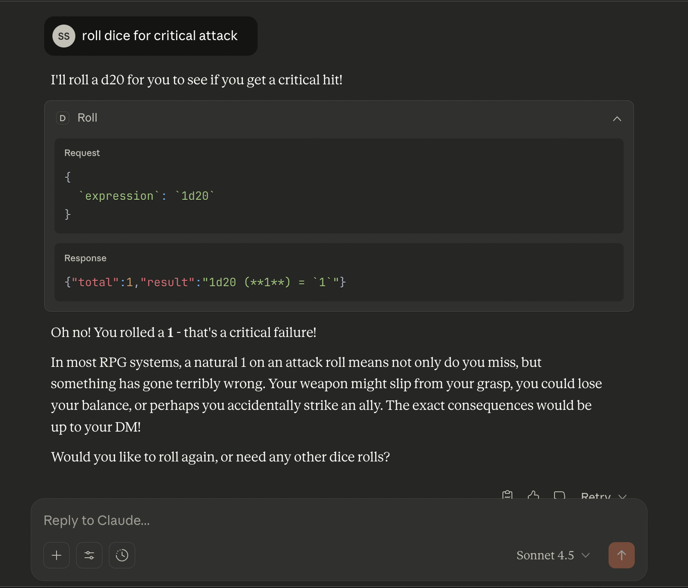

# 🎲 d20-mcp

> 🇬🇧 [Click here for English README / İngilizce README için tıklayın](README.md)

RPG oyunları için güçlü bir MCP (Model Context Protocol) zar atma sunucusu. [FastMCP](https://github.com/jlowin/fastmcp) ve [d20 kütüphanesi](https://github.com/avrae/d20) ile geliştirilmiş bu sunucu, Claude ve diğer MCP istemcilerine kapsamlı zar mekanikleri getirir.

D&D, Pathfinder ve standart zar notasyonu kullanan tüm masa üstü RPG'ler için mükemmel!

## ✨ Özellikler

- **🎯 Basit Atışlar**: Hızlı `1d20+5` ifadeleri ve anında sonuçlar
- **📊 Detaylı Analiz**: AST yapısı ile her zar atışını görün
- **⚡ Toplu Atış**: Birden fazla ifadeyi verimli şekilde atın
- **✅ Syntax Doğrulama**: Atmadan önce ifadeleri kontrol edin
- **🎮 Gelişmiş Mekanikler**: En yüksek/düşük tut, tekrar at, patlayan zarlar ve daha fazlası
- **🤖 LLM-Optimize**: AI anlayışı için kapsamlı araç açıklamaları

## 🚀 Hızlı Başlangıç

### Kolay Kurulum (Remote MCP)

d20-mcp'yi kullanmanın en hızlı yolu - kurulum gerektirmez!

1. Claude Desktop'ı açın
2. **Settings** → **Connectors** bölümüne gidin
3. **Add Custom Connector** tıklayın
4. URL'yi girin: `https://d20-mcp.fastmcp.app/mcp`

> **Not**: Remote MCP desteği şu anda beta aşamasında ve Claude Pro, Max, Team ve Enterprise kullanıcıları için mevcut.

### Yerel Kurulum (Alternatif)

uvx ile yerel kurulum için:

```bash
uvx --from git+https://github.com/saidsurucu/d20-mcp d20-mcp
```

### Claude Desktop Yapılandırması (Yerel)

`claude_desktop_config.json` dosyanıza bunu ekleyin:

**macOS**: `~/Library/Application Support/Claude/claude_desktop_config.json`
**Windows**: `%APPDATA%\Claude\claude_desktop_config.json`

```json
{
  "mcpServers": {
    "d20-mcp": {
      "command": "uvx",
      "args": [
        "--from",
        "git+https://github.com/saidsurucu/d20-mcp",
        "d20-mcp"
      ]
    }
  }
}
```

Claude Desktop'ı tamamen yeniden başlatın (Çıkış yapıp tekrar açın), sonra 🔨 çekiç ikonunu arayın!

## 📸 Ekran Görüntüsü



## 🎮 Kullanım Örnekleri

Kurulduktan sonra, Claude ile şu komutları deneyin:

### Basit Atış
```
Saldırım için 1d20+5 at
```

### Karakter Yaratma
```
Yetenek puanları için 6 kere 4d6kh3 at
```

### Savaş
```
Büyük kılıcım için saldırı (1d20+7) ve hasar (2d8+4) at
```

### Avantajla
```
Avantajlı algılama kontrolü için 2d20kh1+5 at
```

### Karmaşık İfadeler
```
Magic Missile hasarı için (1d4+1)*2 at
```

## 🛠️ Mevcut Araçlar

### `roll`
Toplam ve formatlanmış sonuç döndüren hızlı zar atışları. Standart oyun için mükemmel.

**Kullanım alanı**: Saldırı atışları, yetenek kontrolleri, hasar, kurtarma atışları

### `roll_detailed`
AST yapısı ile detaylı ayrıntı, bireysel zar değerleri ve işlemleri gösterir.

**Kullanım alanı**: Karakter yaratma, karmaşık atışlarda hata ayıklama, şeffaflık

### `roll_batch`
Birden fazla farklı ifadeyi tek işlemde atın.

**Kullanım alanı**: Savaş turları, tüm yetenek puanlarını atma, grup kontrolleri

### `validate_syntax`
Atmadan ifadeleri doğrulayın (rastgelelik yok).

**Kullanım alanı**: Karmaşık ifadeleri test etme, kullanıcı girdisi doğrulama

## 📝 Desteklenen Zar Notasyonu

### Temel
- `1d20` - Bir adet 20 yüzlü zar at
- `3d6` - Üç adet 6 yüzlü zar at
- `d20` - 1d20 ile eşdeğer

### Tut/At
- `4d6kh3` - En yüksek 3'ü tut
- `4d6kl1` - En düşük 1'i tut
- `4d6p1` - En düşük 1'i at

### Tekrar At
- `1d20rr<10` - ≥10 olana kadar tekrar at
- `1d20ro1` - 1'leri bir kez tekrar at

### Patlayan Zarlar
- `1d6e` - Maksimumda patla
- `1d6e6` - 6'da patla

### Min/Max
- `1d20mi10` - Minimum 10
- `1d20ma20` - Maksimum 20

### Aritmetik
- `1d20+5` - Toplama
- `2d6-1` - Çıkarma
- `3d6*2` - Çarpma
- `(1d4+1)*2` - Parantez

### Gelişmiş
- `2d20kh1+5` - D&D'de avantaj
- `2d20kl1+2` - Dezavantaj
- `8d6 [fire]` - Açıklamalı hasar (`allow_comments` ile)

## 🎯 Yaygın RPG Kullanım Senaryoları

### D&D 5e Karakter Yaratma
```
4d6 en yüksek 3 tut kullanarak 6 yetenek puanı at
```

### Avantajla Saldırı
```
Bu saldırıda avantajım var. 2d20kh1+8 at
```

### Kritik Vuruş
```
Kritik vurdum! Sneak attack hasarım için 4d6+2d6+5 at
```

### Çoklu Kurtarma Atışları
```
4 grup üyesi için kurtarma atışları: 1d20+5, 1d20+2, 1d20+7, 1d20+3
```

## 🔧 Geliştirme

### Yerel Test

```bash
# Repoyu klonlayın
git clone https://github.com/saidsurucu/d20-mcp.git
cd d20-mcp

# uv ile çalıştırın
uv run server.py

# Veya Python ile direkt (bağımlılıkları kurduktan sonra)
python server.py
```

### Proje Yapısı

```
d20-mcp/
├── server.py          # 4 araçlı ana MCP sunucusu
├── pyproject.toml     # Proje konfigürasyonu
├── README.md          # İngilizce dokümantasyon
├── README.tr.md       # Türkçe dokümantasyon
└── LICENSE            # MIT Lisansı
```

## 🤝 Katkıda Bulunma

Katkılar memnuniyetle karşılanır! Yapabilecekleriniz:
- Hata bildirin
- Yeni özellikler önerin
- Pull request gönderin
- Dokümantasyonu iyileştirin

## 📄 Lisans

MIT Lisansı - detaylar için [LICENSE](LICENSE) dosyasına bakın.

## 🙏 Teşekkürler

Şunlarla geliştirilmiştir:
- **[d20](https://github.com/avrae/d20)** - Güçlü zar atma motoru
- **[FastMCP](https://github.com/jlowin/fastmcp)** - FastMCP framework
- **[MCP](https://github.com/anthropics/mcp)** - Model Context Protocol

## 📚 Daha Fazla Bilgi

- [Model Context Protocol Dokümantasyonu](https://modelcontextprotocol.io)
- [FastMCP Dokümantasyonu](https://gofastmcp.com)
- [d20 Kütüphane Dokümantasyonu](https://github.com/avrae/d20)

---

TTRPG topluluğu için ❤️ ile yapıldı
